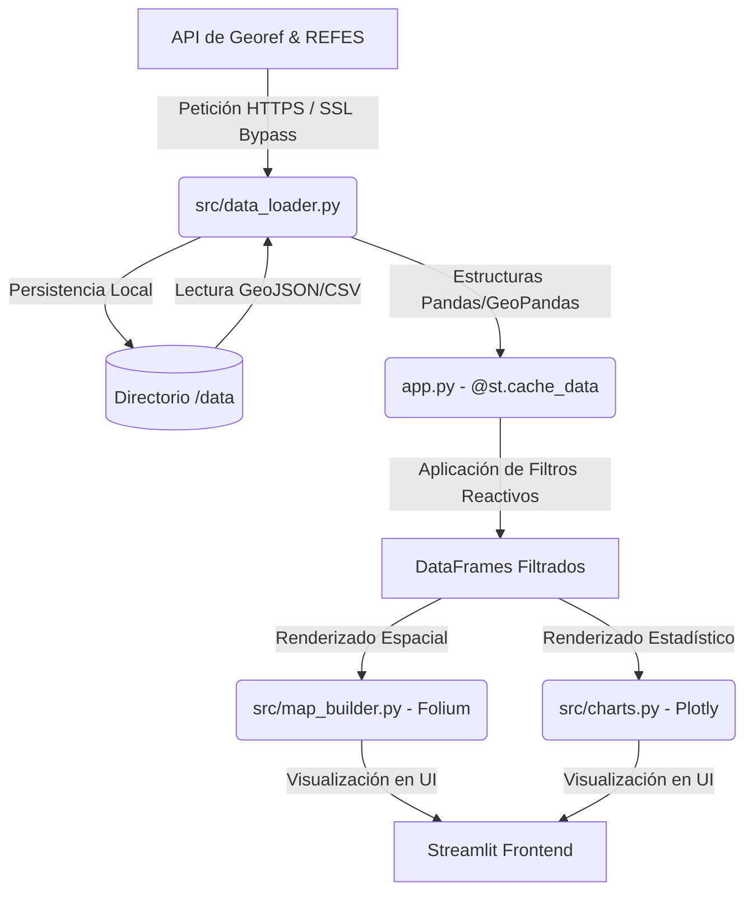

# Documentación Técnica del Proyecto: Salud Mendoza (CRA)

Este documento detalla la arquitectura, el flujo de datos, el diseño de componentes y las justificaciones de ingeniería de software para el panel de análisis territorial y accesibilidad de los efectores de salud en la provincia de Mendoza.

---

## 1. Arquitectura del Sistema y Flujo de Datos

La aplicación está diseñada bajo una arquitectura modular monolítica y de ejecución reactiva orientada a datos, utilizando **Streamlit** como servidor web y framework de frontend reactivo, **Pandas** y **GeoPandas** para el procesamiento espacial-analítico, y **Folium (Leaflet)** y **Plotly** para el motor de renderizado visual.

### Arquitectura de Capas
El proyecto se organiza de la siguiente manera:
- **Capa de Presentación (`app.py` y `.streamlit/config.toml`):** Controla el ciclo de vida del renderizado de la UI, la inyección de estilos (CSS) y la interacción reactiva (filtros y navegación).
- **Capa de Servicios de Visualización (`src/map_builder.py` y `src/charts.py`):** Encapsula la lógica de instanciación de mapas interactivos e histogramas/gráficos circulares.
- **Capa de Datos y Persistencia (`src/data_loader.py`):** Administra el ciclo de vida de la ingesta de datos, aplicando estrategias de caché local, manejo de seguridad SSL y sanitización de geometrías.
- **Capa de Infraestructura (`Dockerfile` y `docker-compose.yml`):** Define el entorno virtualizado y la orquestación del contenedor.



---

## 2. Desglose Detallado de Componentes

### 2.1 Ingesta de Datos y Estrategia de Caché (`src/data_loader.py`)

El módulo `data_loader.py` resuelve la persistencia temporal de recursos y la resiliencia ante fallos de conectividad.

```python
import os
import ssl
import requests
import urllib3
import pandas as pd
import geopandas as gpd

# Configuración de bypass de seguridad SSL
ssl._create_default_https_context = ssl._create_unverified_context
urllib3.disable_warnings(urllib3.exceptions.InsecureRequestWarning)
```

#### Justificaciones de Diseño en la Carga de Datos:
1. **Bypass de Certificados SSL:**
   Los portales de datos gubernamentales (`datos.salud.gob.ar` y `apis.datos.gob.ar`) con frecuencia presentan problemas de configuración en sus cadenas de certificados o vencimientos temporales. La inyección de `ssl._create_unverified_context` y la desactivación de advertencias de `urllib3` es una decisión pragmática para asegurar la continuidad del servicio frente a fallos de infraestructura ajenos a la aplicación.
2. **Patrón de Cache de Dos Capas (Local Disk & Memory Cache):**
   - **Capa 1: Persistencia en Disco (`/data`):** Las funciones `load_departments` y `load_health_centers` implementan una verificación de existencia local antes de iniciar descargas HTTP. Esto optimiza el ancho de banda del cliente y permite que la aplicación funcione en entornos aislados o sin internet (*offline-ready*) una vez completada la primera ejecución.
   - **Capa 2: Caché de Memoria (`@st.cache_data` en `app.py`):** Los objetos de datos espaciales y tabulares se cargan en la RAM del proceso de Streamlit, evitando la deserialización de archivos (operación E/S costosa) en cada interacción del usuario.
3. **Población Censo 2022 Estática:**
   La variable `POPULATION_DATA` almacena de forma hardcodeada los habitantes por departamento. Dado que la información del Censo Nacional 2022 es inmutable a mediano plazo, evitar llamadas a APIs adicionales para este conjunto específico de datos garantiza predictibilidad y menor latencia.
4. **Sanitización de Coordenadas:**
   En `load_health_centers`, se realiza la conversión explícita de `longitud` y `latitud` a numérico mediante coerción de errores (`errors="coerce"`), eliminando los registros que carecen de coordenadas válidas (`dropna`). Esto evita excepciones en el motor de renderizado de Folium y asegura la integridad espacial.

---

### 2.2 Motor de Visualización Espacial (`src/map_builder.py`)

El constructor de mapas interactivos utiliza Folium, un wrapper de Python para la biblioteca Leaflet.js.

```python
def build_map(df_centers, gdf_deps, buffer_radius_km=0.0):
    m = folium.Map(location=[-34.0, -68.5], zoom_start=7, tiles="cartodbpositron")
    ...
```

#### Decisiones de Ingeniería Espacial:
1. **Marker Clustering (Agrupamiento de Marcadores):**
   El volumen de centros de salud georreferenciados en Mendoza supera los 400 elementos. Renderizarlos individualmente degrada significativamente el rendimiento del DOM en el navegador del cliente. La implementación de `MarkerCluster` agrupa los puntos por proximidad geográfica, difiriendo la carga de marcadores individuales a niveles de zoom mayores y optimizando el consumo de CPU.
2. **Representación de Áreas de Cobertura mediante Buffers Dinámicos:**
   Cuando `buffer_radius_km > 0.0`, el sistema calcula dinámicamente un área de influencia (`folium.Circle`) alrededor de cada efector de salud. La conversión matemática a metros (`radius=float(buffer_radius_km) * 1000`) y la transparencia del relleno (`fill_opacity=0.05`) permiten superponer coberturas sin saturar visualmente el mapa, identificando visualmente los "desiertos de cobertura".
3. **Estilización No Intrusiva (CartoDB Positron):**
   El uso del mapa base `"cartodbpositron"` (con escala de grises y diseño minimalista) garantiza que los marcadores de salud (cuyo esquema de color verde esmeralda y verde turquesa distingue la gestión pública y privada) destaquen sin competir visualmente con la cartografía base.

---

### 2.3 Generación de Visualizaciones Estadísticas (`src/charts.py`)

El módulo `charts.py` genera representaciones visuales interactivas alineadas con el sistema de diseño oscuro de la aplicación.

#### Decisiones de Diseño Estadístico:
1. **Transparencia en Fondos de Gráficos:**
   Todos los gráficos tienen sus propiedades `paper_bgcolor` y `plot_bgcolor` definidas en `"rgba(0,0,0,0)"`. Esto permite que se fundan perfectamente con el fondo verde oscuro (`#042f2e`) establecido en la configuración de Streamlit, previniendo los clásicos "bloques blancos" que arruinan la estética dark-mode de la UI.
2. **Normalización por Habitante (Tasa Per Cápita):**
   En `build_centers_per_capita_chart`, no solo se evalúa la cantidad absoluta de efectores (lo que sesgaría el análisis hacia departamentos del Gran Mendoza debido a su mayor infraestructura), sino que se normaliza mediante la fórmula:
   $$\text{Tasa} = \frac{\text{Centros de Salud}}{\text{Población}} \times 10,000$$
   Esto revela asimetrías reales: departamentos con pocos centros pero muy baja población pueden tener tasas per cápita muy altas, requiriendo un análisis más profundo sobre la dispersión geográfica del territorio.

---

### 2.4 Panel de Control y Maquetación (`app.py`)

`app.py` orquesta la ejecución reactiva, el ruteo lógico de pantallas y la inyección estética.

```python
st.set_page_config(
    page_title="Salud Mendoza",
    page_icon="🏥",
    layout="wide",
    initial_sidebar_state="expanded"
)
```

#### Decisiones de Desarrollo del Frontend:
1. **Inyección de CSS Local mediante `unsafe_allow_html=True`:**
   Streamlit restringe la personalización directa del DOM. La inyección de reglas CSS personalizadas permite unificar la tipografía, aplicar bordes redondeados y sombreados suaves (*box-shadow*) a las tarjetas de métricas (`st.metric`), y forzar el uso del color de texto `#ccfbf1` en los elementos de alerta. Esto transforma la interfaz básica de Streamlit en una experiencia premium.
2. **Ciclo de Ejecución Reactiva e Inferencia de Filtros:**
   Streamlit ejecuta el script completo de arriba a abajo ante cada cambio en los widgets. La lógica de filtrado multidimensional:
   ```python
   df_filtered = df_centers.copy()
   if selected_depts:
       df_filtered = df_filtered[df_filtered["departamento_nombre"].isin(selected_depts)]
   if selected_sectors:
       df_filtered = df_filtered[df_filtered["origen_financiamiento"].isin(selected_sectors)]
   if selected_tipologies:
       df_filtered = df_filtered[df_filtered["tipologia_nombre"].isin(selected_tipologies)]
   ```
   Opera en milisegundos gracias al motor vectorizado de Pandas en memoria, lo que permite que el mapa y la tabla de datos inferior se actualicen instantáneamente en sincronía con los filtros laterales.

---

## 3. Entorno de Ejecución e Infraestructura

El proyecto está preparado para ejecutarse en entornos locales o de producción sin discrepancias de dependencias gracias a **Docker**.

### 3.1 Dockerfile
```dockerfile
FROM python:3.12-slim

WORKDIR /app

RUN apt-get update && apt-get install -y --no-install-recommends \
    build-essential \
    curl \
    && rm -rf /var/lib/apt/lists/*

COPY requirements.txt .
RUN pip install --no-cache-dir -r requirements.txt

COPY . .

EXPOSE 8501

HEALTHCHECK CMD curl --fail http://localhost:8501/_stcore/health

ENTRYPOINT ["streamlit", "run", "app.py", "--server.port=8501", "--server.address=0.0.0.0"]
```

#### Decisiones de Dockerización:
- **Uso de Imagen Base `slim`:** Reduce la superficie de ataque y el tamaño final de la imagen en comparación con las imágenes estándar basadas en Debian completo o Alpine (las cuales a menudo presentan problemas al compilar binarios C para dependencias complejas como Shapely/GEOS).
- **Control de Caché de Docker Layers:** Copiar `requirements.txt` e instalar las dependencias de Python de forma aislada (líneas 10 y 11) antes de copiar el resto del código (`COPY . .`) garantiza que los tiempos de recompilación de la imagen en desarrollo sean extremadamente bajos, ya que los paquetes de Python no se reinstalarán a menos que se altere el archivo de requerimientos.
- **Implementación de Healthcheck:** El comando `HEALTHCHECK` permite a orquestadores (como Docker Compose o Kubernetes) conocer el estado interno del servidor web de Streamlit consultando el endpoint nativo `/_stcore/health`, garantizando despliegues seguros sin tiempo de inactividad (*zero-downtime deployments*).

### 3.2 docker-compose.yml
```yaml
version: '3.8'

services:
  streamlit-app:
    build: .
    ports:
      - "8501:8501"
    volumes:
      - .:/app
    environment:
      - PYTHONUNBUFFERED=1
```

#### Decisiones de Docker Compose:
- **Volume Mounting en Desarrollo (`.:/app`):** Al mapear el directorio local al contenedor, se activa el hot-reloading. Cualquier cambio en el código fuente de Python es detectado por Streamlit y reflejado en el navegador en tiempo real, sin necesidad de reiniciar o reconstruir la imagen Docker.
- **`PYTHONUNBUFFERED=1`:** Envía la salida estándar y la salida de errores directamente al terminal del contenedor sin búfer intermedio, lo que facilita el debugging a través de los logs en tiempo real (`docker logs`).

---

## 4. Resumen de Decisiones de Diseño y Buenas Prácticas

| Concepto | Implementación | Justificación Técnica |
| :--- | :--- | :--- |
| **Caché en Memoria** | `@st.cache_data` | Previene la lectura reiterada de disco (E/S) en la naturaleza reactiva de Streamlit, manteniendo la UI veloz. |
| **Caché Física** | Guardado local en `/data` | Permite el inicio offline de la aplicación y reduce el consumo innecesario de las APIs del Ministerio de Salud. |
| **Manipulación Espacial** | GeoPandas y CRS EPSG:4326 | Estándar de coordenadas geográficas (WGS84) ideal para integración directa con APIs REST y Leaflet. |
| **Optimización de Mapas** | `MarkerCluster` | Evita el colapso del renderizado DOM del cliente al agrupar cientos de marcadores georreferenciados. |
| **Integración de Estilos** | CSS personalizado embebido | Sortea las rigideces visuales nativas de Streamlit, logrando una estética dark-teal cohesiva. |
| **Contenerización** | Docker Slim + Volumes | Garantiza reproducibilidad absoluta en cualquier SO y agiliza el flujo de desarrollo mediante hot-reloading. |
