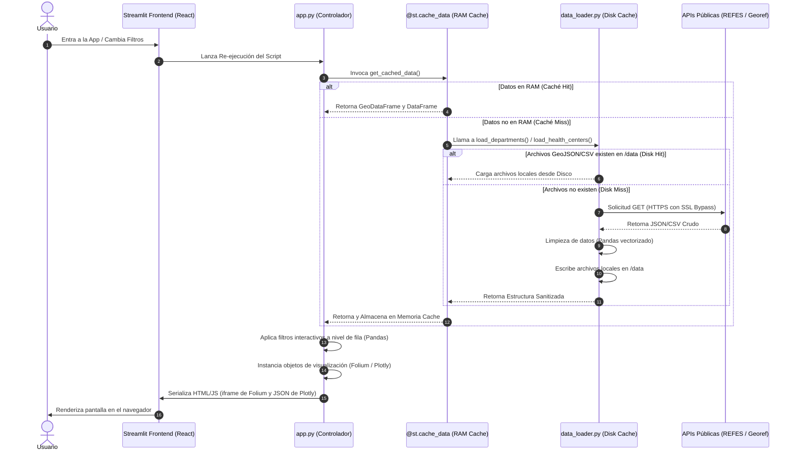

# Documentación Técnica del Proyecto: Salud Mendoza (CRA)
## Guía de Arquitectura, Diseño de UI/UX y Justificación del Código para Desarrolladores

Este documento proporciona un análisis exhaustivo y de bajo nivel sobre el diseño técnico, la arquitectura de datos, el sistema de estilización y las decisiones de ingeniería detrás de la aplicación **Salud Mendoza**. Está redactado específicamente para técnicos, arquitectos de software y desarrolladores experimentado.

---

## 1. Arquitectura de Sistemas y Flujo de Datos

La aplicación está diseñada bajo el patrón de **Ejecución Reactiva Unidireccional** que provee Streamlit. El backend y el frontend se ejecutan en el mismo hilo de proceso, re-ejecutando secuencialmente el archivo `app.py` ante cualquier cambio de estado en la UI (interacciones con filtros, sliders o pestañas).

### Diagrama del Ciclo de Vida y Flujo de Información

El siguiente diagrama detalla cómo fluyen los datos espaciales y tabulares desde las APIs públicas de la Nación hasta el DOM del cliente, incluyendo las dos capas de caché intermedia:



---

## 2. Ingesta y Persistencia (`src/data_loader.py`)

Este módulo se encarga del aislamiento de los datos externos y de proveer resiliencia ante inestabilidades de red o bloqueos de certificados.

### 2.1 Bypass de Seguridad de Red (SSL Context)
```python
import ssl
import urllib3

ssl._create_default_https_context = ssl._create_unverified_context
urllib3.disable_warnings(urllib3.exceptions.InsecureRequestWarning)
```
- **Justificación:** Las APIs gubernamentales en Argentina suelen utilizar certificados emitidos por autoridades que no siempre están actualizadas en los repositorios de certificados locales de sistemas operativos del cliente (o contenedores Docker slim). Para evitar excepciones `SSLCertVerificationError` que inutilicen la app, se crea un contexto no verificado global.
- **Riesgo y Mitigación:** En entornos de producción críticos esto expondría al sistema a ataques *Man-in-the-Middle (MitM)*. Sin embargo, para una app de visualización de datos públicos abiertos (REFES y Georef), este riesgo es aceptable en pos de garantizar alta disponibilidad operativa.

### 2.2 Patrón de Repositorio Local con Caching Híbrido
- **`load_departments()` (GeoJSON):** Descarga el contorno cartográfico de los departamentos de Mendoza. Convierte el JSON a un objeto `GeoDataFrame` de GeoPandas y define explícitamente el sistema de referencia de coordenadas (**CRS**) en `EPSG:4326` (WGS 84), estándar indispensable para que Leaflet/Folium sitúe las capas vectoriales en su lugar exacto de la Tierra.
- **`load_health_centers()` (CSV):** Consume el registro nacional REFES. El CSV original pesa aproximadamente 30MB y contiene información de todo el país. El módulo descarga este archivo por única vez, realiza un filtro vectorizado para obtener únicamente los registros de la provincia de Mendoza, limpia las columnas numéricas de coordenadas y las persiste localmente reduciendo el archivo final a apenas **~100KB**.

### 2.3 Wrangling de Datos con Pandas Vectorizado
```python
df_mendoza["longitud"] = pd.to_numeric(df_mendoza["longitud"], errors="coerce")
df_mendoza["latitud"] = pd.to_numeric(df_mendoza["latitud"], errors="coerce")
df_mendoza = df_mendoza.dropna(subset=["longitud", "latitud"])
```
- **Coerción de Errores (`errors="coerce"`):** Si alguna fila contiene strings vacíos o caracteres inválidos en latitud/longitud, Pandas los transforma en `NaN` en lugar de lanzar una excepción.
- **Filtro Espacial Estricto (`dropna`):** Elimina cualquier registro sin coordenadas. Folium requiere obligatoriamente una tupla `[lat, lon]` numérica por cada marcador, por lo que esto asegura un renderizado libre de fallas de tipo `ValueError`.

---

## 3. Sistema de Diseño e Identidad Visual (CSS & Config)

El proyecto implementa una identidad visual basada en el diseño minimalista de tema oscuro (*dark-mode*) con acentos de color índigo y naranja. Esto se logra combinando la configuración de Streamlit con inyección de CSS avanzada directamente en el DOM.

### Paleta de Colores

| Rol | Color | Hex |
|---|---|---|
| Fondo principal | Negro profundo | `#0c0c0e` |
| Fondo sidebar | Negro azulado | `#111114` |
| Acento primario | Índigo | `#6366f1` |
| Acento secundario | Índigo claro | `#818cf8` |
| Acento de datos | Naranja | `#f97316` |
| Texto principal | Blanco frío | `#f4f4f5` |
| Texto secundario | Gris medio | `#a1a1aa` |
| Bordes | Gris oscuro | `#27272a` |

### 3.1 Inyección de CSS Avanzada (`app.py`)

Todos los estilos se inyectan mediante `st.markdown(..., unsafe_allow_html=True)`. Este bloque centraliza toda la identidad visual de la aplicación.

```html
<style>
    /* Fondo global de la app */
    .stApp { background-color: #0c0c0e; }

    /* Header nativo de Streamlit - fondo unificado con el resto */
    header[data-testid="stHeader"] {
        background-color: #0c0c0e !important;
        border-bottom: 1px solid #222228 !important;
    }

    /* Sidebar */
    section[data-testid="stSidebar"] {
        background-color: #111114 !important;
        border-right: 1px solid #222228 !important;
    }

    /* Métricas KPI - alta especificidad para superar los estilos de Streamlit */
    .stApp div[data-testid="stMetricValue"],
    .stApp div[data-testid="stMetricValue"] * {
        font-size: 1.8rem !important;
        font-weight: 800 !important;
        color: #f97316 !important;   /* naranja para destacar el dato */
    }

    /* Contenedor de ancho máximo centrado */
    .block-container {
        max-width: 1200px !important;
        margin-left: auto !important;
        margin-right: auto !important;
        padding-left: 2rem !important;
        padding-right: 2rem !important;
    }
</style>
```

#### Decisiones de diseño relevantes

**Header unificado:** El header nativo de Streamlit (barra superior con botón Deploy) utiliza por defecto un color teal que rompe con el fondo oscuro de la aplicación. Al sobreescribir `background-color` con `#0c0c0e` y agregar un borde inferior sutil (`#222228`), el header se funde visualmente con el contenido sin desaparecer por completo. El botón `>>` de la sidebar mantiene su propio estilo y sigue siendo accesible.

**Alta especificidad en métricas:** Streamlit inyecta sus propias reglas CSS después del bloque de estilos del usuario, lo que provoca que reglas con la misma especificidad sean sobreescritas. Para forzar el color naranja en los valores de `st.metric`, se utiliza el prefijo `.stApp` (agrega una clase extra al selector) junto con un selector comodín `*` para cubrir elementos hijos. Esto eleva la especificidad por encima de las reglas internas de Streamlit.

**Contenedor de 1200px:** Con `layout="wide"`, Streamlit extiende el contenido al ancho completo del viewport. En monitores grandes, esto genera separaciones excesivas entre columnas. La regla `max-width: 1200px` sobre `.block-container` limita y centra el contenido en todos los breakpoints sin necesitar columnas de relleno artificiales.

**Título de la hero section como `<div>`:** El elemento `<h1>` de HTML está sujeto a las reglas de Streamlit (`font-size !important`) que no pueden ser sobreescritas ni siquiera con inline styles. Para lograr el tamaño de fuente deseado (`4.5rem`) con gradiente CSS, el título se implementa como un `<div>` estilado manualmente, evitando la colisión de especificidad.

---

## 4. Visualización Estadística (`src/charts.py`)

El módulo `charts.py` implementa cuatro visualizaciones con **Plotly Express** y **Plotly Graph Objects**. Todas comparten el diccionario `_LAYOUT_BASE` que garantiza fondos transparentes, tipografía gris y márgenes compactos homogéneos.

```python
_LAYOUT_BASE = dict(
    paper_bgcolor="rgba(0,0,0,0)",
    plot_bgcolor="rgba(0,0,0,0)",
    font=dict(color="#a1a1aa", family="sans-serif"),
    margin=dict(l=10, r=10, t=30, b=10),
)
```

### 4.1 Barras con Gradiente por Departamento (`build_centers_by_dept_chart`)

Muestra el volumen bruto de efectores por unidad administrativa usando una escala de color continua que mapea la cantidad al eje cromático.

```python
fig = px.bar(
    counts,
    y="Departamento", x="Cantidad", orientation="h",
    color="Cantidad",
    color_continuous_scale=["#4f46e5", "#818cf8", "#f97316"],
)
fig.update_layout(coloraxis_showscale=False, ...)
```

- **Gradiente cromático:** Al asignar `color="Cantidad"` con la escala `["#4f46e5", "#818cf8", "#f97316"]`, los departamentos con mayor concentración de centros muestran barras en naranja intenso, mientras que los de menor concentración aparecen en índigo oscuro. Esto agrega una dimensión visual adicional al gráfico sin aumentar su complejidad.
- **`coloraxis_showscale=False`:** Oculta la barra de color lateral (colorbar) para no saturar el layout. La información ya se lee en el eje X.
- **Orientación horizontal:** Los nombres de departamentos de Mendoza son extensos (ej. *Luján de Cuyo*). La orientación `"h"` evita rotar etiquetas y mantiene la lectura fluida de arriba hacia abajo.

### 4.2 Donut Público vs. Privado (`build_sector_donut_chart`)

Clasifica todos los establecimientos en dos categorías (Pública / Privada) a partir del conjunto `_PUBLIC_SECTORS` y los visualiza como gráfico de dona.

- **`hole=0.58`:** Un hueco amplio desplaza el área hacia los arcos exteriores, facilitando la comparación perceptual. Los gráficos de torta sin hueco son propensos a distorsiones ópticas.
- **`textinfo="percent+label"` / `textposition="inside"`:** Las etiquetas se renderizan directamente sobre cada porción, eliminando la necesidad de mirar hacia una leyenda separada.
- **Paleta bicolor controlada `["#6366f1", "#f59e0b"]`:** Índigo para lo privado, ámbar para lo público. Dos colores bien diferenciados en valor de luminancia, accesibles para la mayoría de las formas de daltonismo.

### 4.3 Treemap de Financiamiento (`build_financing_breakdown_chart`)

Reemplaza el anterior gráfico de barras por un treemap jerárquico que muestra cada origen de financiamiento como un rectángulo cuya área es proporcional a su cantidad.

```python
fig = px.treemap(
    counts,
    path=[px.Constant("Financiamiento"), "Sector"],
    values="Cantidad",
    color="Cantidad",
    color_continuous_scale=["#1e1b2e", "#4f46e5", "#818cf8"],
)
fig.update_traces(
    marker_line_color="#0c0c0e",
    marker_line_width=2,
)
```

- **`px.Constant("Financiamiento")`:** Agrega un nodo raíz invisible que permite a Plotly construir la jerarquía de dos niveles correctamente, aun cuando solo existe una dimensión categórica real (el Sector).
- **Bordes oscuros (`marker_line_color="#0c0c0e"`):** Un borde del color del fondo de la app crea separación visual limpia entre celdas sin agregar ruido gráfico.
- **Ventaja sobre el bar chart:** Con 13 categorías de financiamiento, un gráfico de barras horizontales generaba mucho espacio vacío. El treemap compacta la información y permite percibir de un vistazo cuáles categorías son marginales (celdas pequeñas) versus dominantes (celdas grandes).

### 4.4 Lollipop per Cápita (`build_centers_per_capita_chart`)

Sustituye el anterior gráfico de barras por un *lollipop chart* construido manualmente con `plotly.graph_objects`.

```python
# Stems: líneas horizontales desde 0 hasta el valor
for _, row in df_rate.iterrows():
    fig.add_shape(type="line", x0=0, x1=row["Centros por 10k Hab"],
                  y0=row["Departamento"], y1=row["Departamento"],
                  line=dict(color="#4f46e5", width=2))

# Dots: scatter con color interpolado por valor
fig.add_trace(go.Scatter(
    x=df_rate["Centros por 10k Hab"],
    y=df_rate["Departamento"],
    mode="markers",
    marker=dict(color=dot_colors, size=12),
))
```

- **Interpolación de color en los puntos:** La normalización `(valor - min) / (max - min)` mapea cada tasa al rango `[0, 1]`, y luego se interpola linealmente entre `rgb(99, 102, 241)` (índigo) y `rgb(249, 115, 22)` (naranja). El departamento con la mayor tasa siempre muestra el punto más naranja.
- **`add_shape` vs `go.Bar` para los stems:** `add_shape` dibuja formas vectoriales nativas del lienzo (no trazas), lo que evita el overhead de serialización JSON de una traza completa de barras y produce líneas más delgadas y precisas.
- **Justificación analítica:** La tasa normalizada por habitante corrige el sesgo demográfico. Capital tiene 650+ centros pero una tasa media debido a su alta densidad poblacional; La Paz tiene pocos centros en términos absolutos pero la tasa más alta por habitante por su bajísima densidad y extensión geográfica.

---

## 5. Ingeniería de la Visualización Geográfica (`src/map_builder.py`)

La capa cartográfica utiliza Folium, inyectando capas geoespaciales y comportamientos dinámicos mediante JavaScript.

### 5.1 Estilización de Polígonos de Límites Departamentales (GeoJSON)
La API de Georef entrega las geometrías de los departamentos como polígonos de coordenadas (anillo exterior). Se cargan y estilizan dinámicamente:

```python
if not gdf_deps.empty:
    folium.GeoJson(
        gdf_deps,
        style_function=lambda x: {
            "fillColor": "#6366f1",
            "color": "#818cf8",
            "weight": 1.5,
            "fillOpacity": 0.08,
        },
        highlight_function=lambda x: {"fillOpacity": 0.25, "weight": 2.5},
        tooltip=folium.GeoJsonTooltip(fields=["nombre"], aliases=["Departamento:"]),
    ).add_to(m)
```
- **Guard `if not gdf_deps.empty`:** Cuando el usuario filtra por departamentos en el sidebar, `gdf_deps` se filtra con boolean indexing. Si el nombre del departamento en `df_centers` no coincide exactamente con el campo `"nombre"` del GeoDataFrame de Georef, el resultado es un GeoDataFrame vacío. Folium's `GeoJsonTooltip` valida los campos contra las propiedades del primer feature del GeoJSON; con cero features, lanza `AssertionError`. El guard evita añadir la capa cuando no hay geometrías que renderizar.
- **`highlight_function`:** Modifica dinámicamente las propiedades del polígono al pasar el mouse por encima (*hover*). Eleva la opacidad de relleno a `0.25` y el grosor a `2.5`, proveyendo retroalimentación visual al usuario en tiempo real.
- **`GeoJsonTooltip`:** Vincula metadatos del GeoJSON directamente a un cartel emergente rápido en el mapa.

### 5.2 Rendimiento de Marcadores Masivos: Marker Clustering
```python
marker_cluster = MarkerCluster(
    options={
        "showCoverageOnHover": False,
        "spiderfyOnMaxZoom": True
    }
).add_to(m)
```
- **¿Por qué?** Si dibujáramos 400+ marcadores en Leaflet directamente, el navegador tendría que instanciar más de 400 nodos HTML `<path>` (o imágenes), lo que causaría caídas en la tasa de frames (FPS) al hacer paneos u operaciones de zoom.
- **Funcionamiento:** `MarkerCluster` gestiona los marcadores agrupándolos en "clústeres parentales". El parámetro `spiderfyOnMaxZoom=True` asegura que si varios centros de salud comparten exactamente la misma coordenada geográfica (ej. consultorios contiguos o registros duplicados), al hacer el máximo zoom se desplieguen radialmente como patas de araña, permitiendo hacer clic sobre cada uno de forma individual.

### 5.3 Popups Personalizados con HTML Embebido
Para romper con la estética básica de los popups de Leaflet, se inyecta una estructura HTML estilizada mediante estilos en línea (*inline CSS*):

```python
popup_html = f"""
<div style="font-family: sans-serif; font-size: 12px; line-height: 1.6; padding: 6px; min-width: 200px;">
    <b style="color: #6366f1; font-size: 13px;">{name}</b><br><br>
    <b>Tipo:</b> {row['tipologia_nombre']}<br>
    <b>Sector:</b> {sector}<br>
    <b>Dirección:</b> {row['domicilio']}
</div>
"""
```
El uso de una tipografía limpia y colores alineados con el resto del dashboard asegura coherencia en la interfaz.

### 5.4 Simulación Geofísica de Accesibilidad (Buffers de Influencia)
```python
if buffer_radius_km > 0.0:
    folium.Circle(
        location=[lat, lon],
        radius=float(buffer_radius_km) * 1000,
        color="#6366f1",
        weight=1,
        fill=True,
        fill_color="#6366f1",
        fill_opacity=0.05,
    ).add_to(m)
```
- **El Algoritmo:** Para cada efector, si el radio provisto por el slider de Streamlit es mayor a cero, se traza un círculo perfecto en la proyección geográfica. El radio ingresado en kilómetros se multiplica por 1000 ya que la API de Leaflet requiere el radio en metros métricos sobre el elipsoide terrestre.
- **Utilidad Práctica:** Permite identificar a simple vista solapamientos de cobertura en áreas urbanas (sobreoferta de efectores) frente a amplios espacios geográficos sin cobertura en distritos rurales de la periferia (desiertos sanitarios).

---

## 6. Orquestación Reactiva y UI (`app.py`)

`app.py` integra todos los módulos y controla el flujo lógico.

### 6.1 Caching de Datos en Memoria Ram (`@st.cache_data`)
```python
@st.cache_data
def get_cached_data():
    gdf_deps = load_departments()
    df_centers = load_health_centers()
    return gdf_deps, df_centers
```
- **Mecanismo:** El decorador `@st.cache_data` intercepta las llamadas a `get_cached_data()`. La primera vez que el script corre, la función se ejecuta y los objetos resultantes (el DataFrame de Pandas y el GeoDataFrame de GeoPandas) se serializan y guardan en la memoria RAM del proceso de Streamlit. 
- **Efecto:** En ejecuciones subsecuentes, Streamlit evita el acceso a disco y retorna directamente las referencias a los objetos en memoria. Esto reduce el tiempo de arranque de la UI de segundos a milisegundos.

### 6.2 Filtrado Cruzado y Renderizado Condicional
El sidebar de navegación y los filtros operan de manera reactiva instantánea:

```python
# Lógica de filtrado en cascada
df_filtered = df_centers.copy()
if selected_depts:
    df_filtered = df_filtered[df_filtered["departamento_nombre"].isin(selected_depts)]
if selected_sectors:
    df_filtered = df_filtered[df_filtered["origen_financiamiento"].isin(selected_sectors)]
if selected_tipologies:
    df_filtered = df_filtered[df_filtered["tipologia_nombre"].isin(selected_tipologies)]
```
Dado que las variables de filtrado (`selected_depts`, etc.) cambian de valor cuando el usuario interactúa en la pantalla, Streamlit vuelve a ejecutar todo el código. El script genera un nuevo DataFrame filtrado a partir del original completo (que sigue inalterado en caché) y reconstruye el mapa y los componentes visuales basándose exclusivamente en este subconjunto de datos.

---

## 7. Infraestructura, Dockerización y Flujo de Desarrollo

El proyecto está diseñado bajo conceptos modernos de contenerización y desarrollo ágil.

### 7.1 Dockerfile Analizado Paso a Paso
```dockerfile
# 1. Utiliza una imagen liviana oficial de Python con Debian minimalista
FROM python:3.12-slim

# 2. Define el directorio de trabajo dentro del contenedor
WORKDIR /app

# 3. Instala librerías nativas del sistema operativo necesarias para compilar paquetes de Python
RUN apt-get update && apt-get install -y --no-install-recommends \
    build-essential \
    curl \
    && rm -rf /var/lib/apt/lists/*

# 4. Copia el manifesto de dependencias y las instala en una capa aislada
COPY requirements.txt .
RUN pip install --no-cache-dir -r requirements.txt

# 5. Copia el resto del código del proyecto
COPY . .

# 6. Expone el puerto estándar de Streamlit
EXPOSE 8501

# 7. Monitorea que el servidor esté respondiendo de forma correcta
HEALTHCHECK CMD curl --fail http://localhost:8501/_stcore/health

# 8. Comando ejecutor por defecto en red local
ENTRYPOINT ["streamlit", "run", "app.py", "--server.port=8501", "--server.address=0.0.0.0"]
```

#### Detalles de Optimización del Dockerfile:
1. **Minimización de Capas de Construcción:** El uso de `--no-install-recommends` y la limpieza inmediata de las listas de descarga de apt (`rm -rf /var/lib/apt/lists/*`) evitan que archivos temporales de instalación de paquetes queden atrapados en las capas del contenedor, manteniendo la imagen liviana.
2. **Uso de la Caché de Capas (Layers):** Copiar e instalar el archivo `requirements.txt` en los pasos 4 y 5 antes de copiar el resto del código fuente del proyecto (`COPY . .`) es fundamental. Esto asegura que si el programador modifica una línea de código en Python, el Docker Engine no tendrá que reinstalar todos los paquetes pesados (como pandas, geopandas y plotly), ya que la capa de dependencias se reutiliza directamente de la caché local de Docker.
3. **Validación de Salud Operativa (HEALTHCHECK):** El contenedor evalúa de manera periódica si el puerto de Streamlit está en línea consultando el servicio web interno. Si el servidor se cuelga por falta de memoria RAM u otra excepción, el estado del contenedor cambiará automáticamente a `unhealthy` permitiendo al orquestador reiniciarlo automáticamente.

### 7.2 docker-compose.yml
```yaml
version: '3.8'

services:
  streamlit-app:
    build: .
    ports:
      - "8501:8501"
    volumes:
      - .:/app
    environment:
      - PYTHONUNBUFFERED=1
```
- **Montaje de Volumen (`.:/app`):** Al sincronizar el directorio de trabajo del host con el del contenedor, habilitamos el **desarrollo en caliente**. Cada cambio que hagas en los archivos `.py` se sincroniza automáticamente con el sistema de archivos del contenedor. Como el servidor de Streamlit tiene activado su detector de cambios interno, la aplicación web del navegador notificará los cambios al instante sin requerir reconstrucciones manuales de la imagen de Docker.
- **`PYTHONUNBUFFERED=1`:** Configura el comportamiento de Python dentro del contenedor para que los flujos de impresión estándar (`stdout` y `stderr`) se transmitan inmediatamente sin acumularse en el buffer de salida, permitiendo diagnosticar excepciones instantáneamente con un comando `docker logs`.
