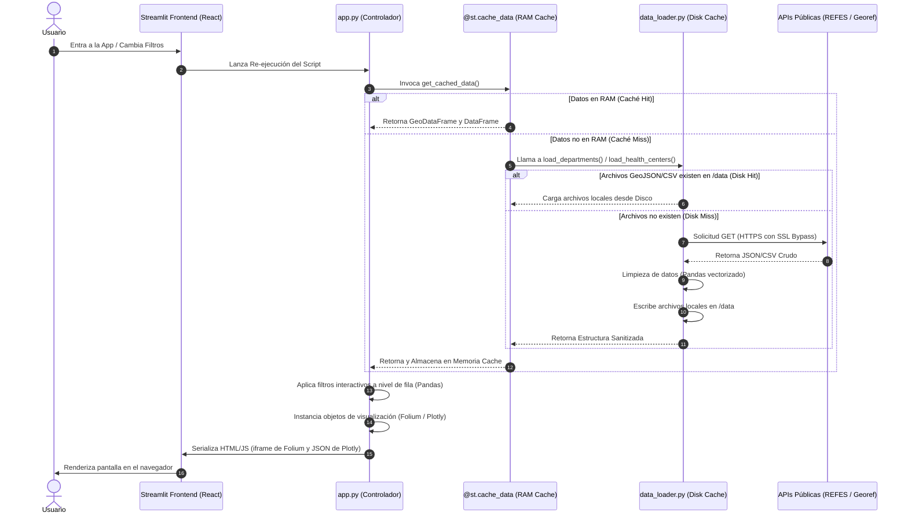

# Documentación Técnica del Proyecto: Salud Mendoza (CRA)
## Guía de Arquitectura, Diseño de UI/UX y Justificación del Código para Desarrolladores

Este documento proporciona un análisis exhaustivo y de bajo nivel sobre el diseño técnico, la arquitectura de datos, el sistema de estilización y las decisiones de ingeniería detrás de la aplicación **Salud Mendoza**. Está redactado específicamente para técnicos, arquitectos de software y desarrolladores experimentado.

---

## 1. Arquitectura de Sistemas y Flujo de Datos

La aplicación está diseñada bajo el patrón de **Ejecución Reactiva Unidireccional** que provee Streamlit. El backend y el frontend se ejecutan en el mismo hilo de proceso, re-ejecutando secuencialmente el archivo `app.py` ante cualquier cambio de estado en la UI (interacciones con filtros, sliders o pestañas).

### Diagrama del Ciclo de Vida y Flujo de Información

El siguiente diagrama detalla cómo fluyen los datos espaciales y tabulares desde las APIs públicas de la Nación hasta el DOM del cliente, incluyendo las dos capas de caché intermedia:



---

## 2. Ingesta y Persistencia (`src/data_loader.py`)

Este módulo se encarga del aislamiento de los datos externos y de proveer resiliencia ante inestabilidades de red o bloqueos de certificados.

### 2.1 Bypass de Seguridad de Red (SSL Context)
```python
import ssl
import urllib3

ssl._create_default_https_context = ssl._create_unverified_context
urllib3.disable_warnings(urllib3.exceptions.InsecureRequestWarning)
```
- **Justificación:** Las APIs gubernamentales en Argentina suelen utilizar certificados emitidos por autoridades que no siempre están actualizadas en los repositorios de certificados locales de sistemas operativos del cliente (o contenedores Docker slim). Para evitar excepciones `SSLCertVerificationError` que inutilicen la app, se crea un contexto no verificado global.
- **Riesgo y Mitigación:** En entornos de producción críticos esto expondría al sistema a ataques *Man-in-the-Middle (MitM)*. Sin embargo, para una app de visualización de datos públicos abiertos (REFES y Georef), este riesgo es aceptable en pos de garantizar alta disponibilidad operativa.

### 2.2 Patrón de Repositorio Local con Caching Híbrido
- **`load_departments()` (GeoJSON):** Descarga el contorno cartográfico de los departamentos de Mendoza. Convierte el JSON a un objeto `GeoDataFrame` de GeoPandas y define explícitamente el sistema de referencia de coordenadas (**CRS**) en `EPSG:4326` (WGS 84), estándar indispensable para que Leaflet/Folium sitúe las capas vectoriales en su lugar exacto de la Tierra.
- **`load_health_centers()` (CSV):** Consume el registro nacional REFES. El CSV original pesa aproximadamente 30MB y contiene información de todo el país. El módulo descarga este archivo por única vez, realiza un filtro vectorizado para obtener únicamente los registros de la provincia de Mendoza, limpia las columnas numéricas de coordenadas y las persiste localmente reduciendo el archivo final a apenas **~100KB**.

### 2.3 Wrangling de Datos con Pandas Vectorizado
```python
df_mendoza["longitud"] = pd.to_numeric(df_mendoza["longitud"], errors="coerce")
df_mendoza["latitud"] = pd.to_numeric(df_mendoza["latitud"], errors="coerce")
df_mendoza = df_mendoza.dropna(subset=["longitud", "latitud"])
```
- **Coerción de Errores (`errors="coerce"`):** Si alguna fila contiene strings vacíos o caracteres inválidos en latitud/longitud, Pandas los transforma en `NaN` en lugar de lanzar una excepción.
- **Filtro Espacial Estricto (`dropna`):** Elimina cualquier registro sin coordenadas. Folium requiere obligatoriamente una tupla `[lat, lon]` numérica por cada marcador, por lo que esto asegura un renderizado libre de fallas de tipo `ValueError`.

---

## 3. Sistema de Diseño e Identidad Visual (CSS & Config)

El proyecto implementa una identidad visual basada en el diseño minimalista de tema oscuro (*dark-mode*) con acentos de color verde turquesa y esmeralda. Esto se logra combinando la configuración de Streamlit con inyección de CSS.

### 3.1 Variables del Tema (`.streamlit/config.toml`)
```toml
[theme]
primaryColor = "#0f766e"          # Verde esmeralda (usado en sliders y botones activos)
backgroundColor = "#042f2e"       # Fondo ultra oscuro (verde petróleo oscuro)
secondaryBackgroundColor = "#115e59" # Fondo secundario para barras y cajas de métricas
textColor = "#ccfbf1"             # Texto mint claro (alto contraste sobre fondo oscuro)
font = "sans serif"
```
Este archivo de configuración de Streamlit define las variables CSS principales del tema a nivel del framework. No obstante, ciertos elementos (como las métricas de KPI y las alertas) requieren estilos específicos que Streamlit no permite modificar de forma nativa.

### 3.2 Inyección de CSS Avanzada (`app.py`)
Para lograr una estética de calidad de producción y un efecto premium, inyectamos estilos CSS en el DOM a través de selectores internos de Streamlit:

```html
<style>
    /* Ajuste de márgenes del contenedor principal de Streamlit */
    .reportview-container .main .block-container {
        padding-top: 2rem;
        padding-bottom: 2rem;
        padding-left: 5rem;
        padding-right: 5rem;
    }
    
    /* Caja contenedora de las métricas st.metric */
    div[data-testid="metric-container"] {
        background-color: #115e59;
        border-radius: 12px;
        padding: 20px;
        border: 1px solid #0f766e;
        box-shadow: 0 4px 6px -1px rgba(0, 0, 0, 0.1), 0 2px 4px -1px rgba(0, 0, 0, 0.06);
    }
    
    /* Personalización del valor de la métrica (número grande) */
    div[data-testid="stMetricValue"] {
        font-size: 32px;
        font-weight: 600;
        color: #ccfbf1;
    }
    
    /* Personalización de la etiqueta de la métrica (texto pequeño superior) */
    div[data-testid="stMetricLabel"] {
        font-size: 14px;
        color: #99f6e4;
        font-weight: 500;
        margin-bottom: 8px;
    }
    
    /* Forzado de color en encabezados para mantener la cohesión cromática */
    h1, h2, h3 {
        color: #ccfbf1 !important;
        font-weight: 600 !important;
    }
    
    /* Estilización de banners informativos (st.info, st.warning, etc) */
    .stAlert {
        background-color: #115e59 !important;
        color: #ccfbf1 !important;
        border: 1px solid #0f766e !important;
    }
</style>
```

#### Explicación de los Selectores CSS inyectados:
- **`div[data-testid="metric-container"]`:** Apunta al contenedor HTML interno de Streamlit para el widget `st.metric`. Al asignarle un fondo sólido `#115e59` ligeramente más claro que el fondo general (`#042f2e`), bordes redondeados (`border-radius: 12px`) y una sombra suave, se emula el patrón de diseño de **tarjetas aisladas** (Dashboard Cards).
- **`div[data-testid="stMetricValue"]` y `div[data-testid="stMetricLabel"]`:** Separan visualmente el dato cuantitativo de su etiqueta descriptiva mediante escala tipográfica (32px vs 14px) y contraste cromático.
- **`.stAlert`:** Estiliza las cajas de alerta nativas de Streamlit, reemplazando sus colores predeterminados (amarillo, azul o rojo estridente) por tonos que armonicen con el esquema de la aplicación.

---

## 4. Visualización Estadística (`src/charts.py`)

El módulo `charts.py` implementa visualizaciones dinámicas de alto rendimiento utilizando **Plotly Express** y personalizando la capa de presentación a través de **Plotly Graph Objects**.

### 4.1 Gráfico 1: Distribución Absoluta de Centros por Departamento (`build_centers_by_dept_chart`)
Muestra el volumen bruto de efectores de salud por unidad administrativa.

- **Creación y lógica de ordenamiento:**
  ```python
  counts = df_centers["departamento_nombre"].value_counts().reset_index()
  counts.columns = ["Departamento", "Cantidad"]
  counts = counts.sort_values(by="Cantidad", ascending=True)
  ```
  Al realizar un `value_counts()` y luego ordenar ascendentemente por la cantidad, logramos que los departamentos con mayor cantidad de centros se sitúen en la parte superior del gráfico al renderizarse de abajo hacia arriba en una orientación horizontal.
- **Justificación de la Orientación Horizontal (`orientation="h"`):**
  Los nombres de los departamentos de Mendoza (ej. *General Alvear*, *Luján de Cuyo*) son extensos. Un gráfico de barras verticales obligaría a rotar las etiquetas de texto a 45 o 90 grados, dificultando la lectura. La orientación horizontal mantiene las etiquetas perfectamente alineadas para una lectura rápida.
- **Estilización e Integración al Tema Oscuro:**
  ```python
  fig.update_layout(
      paper_bgcolor="rgba(0,0,0,0)",
      plot_bgcolor="rgba(0,0,0,0)",
      font=dict(color="#ccfbf1"),
      margin=dict(l=10, r=10, t=30, b=10),
      xaxis=dict(showgrid=True, gridcolor="#115e59"),
      yaxis=dict(showgrid=False)
  )
  ```
  - **`rgba(0,0,0,0)`:** Define los fondos del lienzo como transparentes, dejando ver el fondo de la interfaz del contenedor Streamlit.
  - **`gridcolor="#115e59"`:** Pinta las líneas de cuadrícula verticales con el color de contraste secundario del tema. Se desactiva la cuadrícula del eje Y (`showgrid=False`) para limpiar el gráfico, dejando únicamente las líneas de referencia numérica del eje X.

### 4.2 Gráfico 2: Proporción Público/Privado (`build_sector_distribution_chart`)
Una gráfica circular del tipo Donut para entender el origen de los recursos económicos de los efectores.

- **Diseño del Gráfico Donut (`hole=0.4`):**
  Un gráfico circular tradicional (pie chart) suele ser difícil de leer y saturar la vista. Al añadir un hueco en el centro (`hole=0.4`), el área de visualización se desplaza hacia la periferia, facilitando la comparación de longitudes de arco.
- **Paleta de Colores Exclusiva:**
  Se restringe la paleta a `["#0f766e", "#0d9488"]` (tonos de turquesa controlados). Esto previene el "efecto arcoíris" de los gráficos predeterminados, manteniendo la sobriedad técnica del cuadro de mando.
- **Ubicación de Etiquetas (`textinfo="percent+label"`):**
  Muestra tanto el porcentaje como la categoría directamente sobre la porción del gráfico, reduciendo la fatiga cognitiva del usuario al evitar que tenga que desviar la mirada hacia una leyenda externa.

### 4.3 Gráfico 3: Tasa de Cobertura Relativa Per Cápita (`build_centers_per_capita_chart`)
Este gráfico cruza el total de centros con la población proyectada por departamento.

- **Cálculo de Tasa Normalizada:**
  ```python
  rate = (count / pop) * 10000
  ```
  La simple cuenta absoluta de centros de salud presenta un sesgo demográfico (el Gran Mendoza concentra más centros simplemente porque tiene más población). Al calcular los centros de salud por cada 10.000 habitantes, normalizamos la variable y obtenemos un indicador de equidad territorial.
- **Revelación Crítica de los Datos:**
  El gráfico muestra que departamentos periféricos como **La Paz** o **Santa Rosa**, con muy baja población, poseen tasas de centros por habitante muy elevadas (superior a 8 centros/10k hab). Sin embargo, esto es un contra-balance para compensar la enorme extensión territorial y dispersión geográfica que sufren sus habitantes, mientras que departamentos densamente poblados de la urbe metropolitana como **Guaymallén** presentan tasas menores a 1 centro/10k hab debido a la concentración poblacional.

---

## 5. Ingeniería de la Visualización Geográfica (`src/map_builder.py`)

La capa cartográfica utiliza Folium, inyectando capas geoespaciales y comportamientos dinámicos mediante JavaScript.

### 5.1 Estilización de Polígonos de Límites Departamentales (GeoJSON)
La API de Georef entrega las geometrías de los departamentos como polígonos de coordenadas (anillo exterior). Se cargan y estilizan dinámicamente:

```python
style_function = lambda x: {
    "fillColor": "#115e59",    # Relleno interno
    "color": "#0f766e",        # Línea de frontera
    "weight": 1.5,             # Grosor de la línea
    "fillOpacity": 0.15        # Transparencia
}

folium.GeoJson(
    gdf_deps,
    style_function=style_function,
    highlight_function=lambda x: {"fillOpacity": 0.35, "weight": 2.5},
    tooltip=folium.GeoJsonTooltip(fields=["nombre"], aliases=["Departamento:"])
).add_to(m)
```
- **`highlight_function`:** Modifica dinámicamente las propiedades del polígono al pasar el mouse por encima (*hover*). Eleva la opacidad de relleno a `0.35` y el grosor a `2.5`, proveyendo retroalimentación visual al usuario en tiempo real.
- **`GeoJsonTooltip`:** Vincula metadatos del GeoJSON directamente a un cartel emergente rápido en el mapa.

### 5.2 Rendimiento de Marcadores Masivos: Marker Clustering
```python
marker_cluster = MarkerCluster(
    options={
        "showCoverageOnHover": False,
        "spiderfyOnMaxZoom": True
    }
).add_to(m)
```
- **¿Por qué?** Si dibujáramos 400+ marcadores en Leaflet directamente, el navegador tendría que instanciar más de 400 nodos HTML `<path>` (o imágenes), lo que causaría caídas en la tasa de frames (FPS) al hacer paneos u operaciones de zoom.
- **Funcionamiento:** `MarkerCluster` gestiona los marcadores agrupándolos en "clústeres parentales". El parámetro `spiderfyOnMaxZoom=True` asegura que si varios centros de salud comparten exactamente la misma coordenada geográfica (ej. consultorios contiguos o registros duplicados), al hacer el máximo zoom se desplieguen radialmente como patas de araña, permitiendo hacer clic sobre cada uno de forma individual.

### 5.3 Popups Personalizados con HTML Embebido
Para romper con la estética básica de los popups de Leaflet, se inyecta una estructura HTML estilizada mediante estilos en línea (*inline CSS*):

```python
popup_html = f"""
<div style="font-family: sans-serif; color: #042f2e; font-size: 12px; line-height: 1.4; padding: 5px;">
    <b style="color: #0f766e; font-size: 13px;">{name}</b><br><br>
    <b>Tipo:</b> {tipology}<br>
    <b>Sector:</b> {sector}<br>
    <b>Dirección:</b> {address}
</div>
"""
```
El uso de una tipografía limpia y colores alineados con el resto del dashboard asegura coherencia en la interfaz.

### 5.4 Simulación Geofísica de Accesibilidad (Buffers de Influencia)
```python
if buffer_radius_km > 0.0:
    folium.Circle(
        location=[lat, lon],
        radius=float(buffer_radius_km) * 1000,
        color="#0f766e",
        weight=1,
        fill=True,
        fill_color="#0f766e",
        fill_opacity=0.05
    ).add_to(m)
```
- **El Algoritmo:** Para cada efector, si el radio provisto por el slider de Streamlit es mayor a cero, se traza un círculo perfecto en la proyección geográfica. El radio ingresado en kilómetros se multiplica por 1000 ya que la API de Leaflet requiere el radio en metros métricos sobre el elipsoide terrestre.
- **Utilidad Práctica:** Permite identificar a simple vista solapamientos de cobertura en áreas urbanas (sobreoferta de efectores) frente a amplios espacios geográficos sin cobertura en distritos rurales de la periferia (desiertos sanitarios).

---

## 6. Orquestación Reactiva y UI (`app.py`)

`app.py` integra todos los módulos y controla el flujo lógico.

### 6.1 Caching de Datos en Memoria Ram (`@st.cache_data`)
```python
@st.cache_data
def get_cached_data():
    gdf_deps = load_departments()
    df_centers = load_health_centers()
    return gdf_deps, df_centers
```
- **Mecanismo:** El decorador `@st.cache_data` intercepta las llamadas a `get_cached_data()`. La primera vez que el script corre, la función se ejecuta y los objetos resultantes (el DataFrame de Pandas y el GeoDataFrame de GeoPandas) se serializan y guardan en la memoria RAM del proceso de Streamlit. 
- **Efecto:** En ejecuciones subsecuentes, Streamlit evita el acceso a disco y retorna directamente las referencias a los objetos en memoria. Esto reduce el tiempo de arranque de la UI de segundos a milisegundos.

### 6.2 Filtrado Cruzado y Renderizado Condicional
El sidebar de navegación y los filtros operan de manera reactiva instantánea:

```python
# Lógica de filtrado en cascada
df_filtered = df_centers.copy()
if selected_depts:
    df_filtered = df_filtered[df_filtered["departamento_nombre"].isin(selected_depts)]
if selected_sectors:
    df_filtered = df_filtered[df_filtered["origen_financiamiento"].isin(selected_sectors)]
if selected_tipologies:
    df_filtered = df_filtered[df_filtered["tipologia_nombre"].isin(selected_tipologies)]
```
Dado que las variables de filtrado (`selected_depts`, etc.) cambian de valor cuando el usuario interactúa en la pantalla, Streamlit vuelve a ejecutar todo el código. El script genera un nuevo DataFrame filtrado a partir del original completo (que sigue inalterado en caché) y reconstruye el mapa y los componentes visuales basándose exclusivamente en este subconjunto de datos.

---

## 7. Infraestructura, Dockerización y Flujo de Desarrollo

El proyecto está diseñado bajo conceptos modernos de contenerización y desarrollo ágil.

### 7.1 Dockerfile Analizado Paso a Paso
```dockerfile
# 1. Utiliza una imagen liviana oficial de Python con Debian minimalista
FROM python:3.12-slim

# 2. Define el directorio de trabajo dentro del contenedor
WORKDIR /app

# 3. Instala librerías nativas del sistema operativo necesarias para compilar paquetes de Python
RUN apt-get update && apt-get install -y --no-install-recommends \
    build-essential \
    curl \
    && rm -rf /var/lib/apt/lists/*

# 4. Copia el manifesto de dependencias y las instala en una capa aislada
COPY requirements.txt .
RUN pip install --no-cache-dir -r requirements.txt

# 5. Copia el resto del código del proyecto
COPY . .

# 6. Expone el puerto estándar de Streamlit
EXPOSE 8501

# 7. Monitorea que el servidor esté respondiendo de forma correcta
HEALTHCHECK CMD curl --fail http://localhost:8501/_stcore/health

# 8. Comando ejecutor por defecto en red local
ENTRYPOINT ["streamlit", "run", "app.py", "--server.port=8501", "--server.address=0.0.0.0"]
```

#### Detalles de Optimización del Dockerfile:
1. **Minimización de Capas de Construcción:** El uso de `--no-install-recommends` y la limpieza inmediata de las listas de descarga de apt (`rm -rf /var/lib/apt/lists/*`) evitan que archivos temporales de instalación de paquetes queden atrapados en las capas del contenedor, manteniendo la imagen liviana.
2. **Uso de la Caché de Capas (Layers):** Copiar e instalar el archivo `requirements.txt` en los pasos 4 y 5 antes de copiar el resto del código fuente del proyecto (`COPY . .`) es fundamental. Esto asegura que si el programador modifica una línea de código en Python, el Docker Engine no tendrá que reinstalar todos los paquetes pesados (como pandas, geopandas y plotly), ya que la capa de dependencias se reutiliza directamente de la caché local de Docker.
3. **Validación de Salud Operativa (HEALTHCHECK):** El contenedor evalúa de manera periódica si el puerto de Streamlit está en línea consultando el servicio web interno. Si el servidor se cuelga por falta de memoria RAM u otra excepción, el estado del contenedor cambiará automáticamente a `unhealthy` permitiendo al orquestador reiniciarlo automáticamente.

### 7.2 docker-compose.yml
```yaml
version: '3.8'

services:
  streamlit-app:
    build: .
    ports:
      - "8501:8501"
    volumes:
      - .:/app
    environment:
      - PYTHONUNBUFFERED=1
```
- **Montaje de Volumen (`.:/app`):** Al sincronizar el directorio de trabajo del host con el del contenedor, habilitamos el **desarrollo en caliente**. Cada cambio que hagas en los archivos `.py` se sincroniza automáticamente con el sistema de archivos del contenedor. Como el servidor de Streamlit tiene activado su detector de cambios interno, la aplicación web del navegador notificará los cambios al instante sin requerir reconstrucciones manuales de la imagen de Docker.
- **`PYTHONUNBUFFERED=1`:** Configura el comportamiento de Python dentro del contenedor para que los flujos de impresión estándar (`stdout` y `stderr`) se transmitan inmediatamente sin acumularse en el buffer de salida, permitiendo diagnosticar excepciones instantáneamente con un comando `docker logs`.
